# 02 UI Screen Specification

**Project:** 陸上SNS（仮称）  
**Status:** Canonical UI/UX specification  
**Version:** 2.0  
**Depends on:** `01_product_requirements_and_architecture.md`

> 本書は画面・状態・遷移の正式仕様。モック画像は方向性の参考であり、AI生成画像内の文字、価格、ブランド名、group DM等の誤りより本書を優先する。

---

# 0. UI原則

- iOS first。
- 白基調 + 青系accentを初期デザイン方向とするが、design token化する。
- 1画面1主目的。
- PBやフォロワー数を過度に強調しない。
- 投稿・フォロー・コメント・DMへの導線を短くする。
- タップ領域は44pt以上を基準。
- Dynamic Type / VoiceOver / contrastを考慮。
- loading / empty / error / offline / permission deniedを必ず実装。
- destructive actionは確認を入れる。
- private / teen / restricted stateを通常stateと同格で設計する。

---

# 1. Navigation

Bottom tabs:

1. `ホーム`
2. `さがす`
3. `投稿`（中央+）
4. `通知`
5. `マイページ`

DMはHome右上。

Home tabs:
- `おすすめ`
- `フォロー中`

初期tab: おすすめ。

---

# 2. Screen IDs

## Launch / Auth / Onboarding

- `AUTH-001` Splash
- `AUTH-002` Login
- `ONB-001` Birth date
- `ONB-002` Display name / username
- `ONB-003` Event interests
- `ONB-004` Suggested users
- `ONB-005` Completion

## Home / Discovery

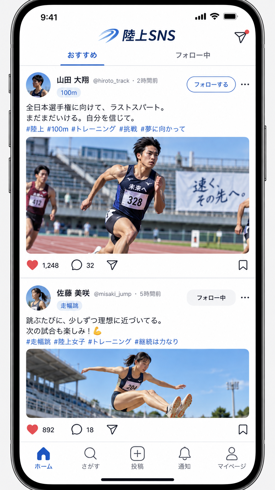

- `HOME-001` Recommended feed
- `HOME-002` Following feed
- `DISC-001` Search / discovery
- `DISC-002` Search results
- `DISC-003` Hashtag detail
- `DISC-004` Event tag detail

## Posts

- `POST-001` Composer
- `POST-002` Media picker
- `POST-003` Event tag picker
- `POST-004` Visibility selector
- `POST-005` Drafts
- `POST-006` Uploading
- `POST-007` Upload failed
- `POST-008` Edit post
- `POST-009` Post detail
- `POST-010` Comments sheet
- `POST-011` Likers list

## Profile / Social

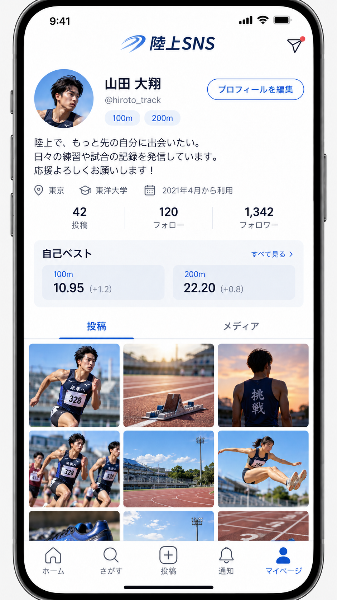

- `PROFILE-001` Own profile
- `PROFILE-002` Other public profile
- `PROFILE-003` Other private profile
- `PROFILE-004` Edit profile
- `SOCIAL-001` Followers
- `SOCIAL-002` Following
- `SOCIAL-003` Follow requests
- `SOCIAL-004` Saved posts

## DM

- `DM-001` Conversation list
- `DM-002` Message requests
- `DM-003` Conversation
- `DM-004` DM media viewer
- `DM-005` DM settings

## Notifications

- `NOTI-001` Notifications
- `NOTI-002` Notification settings

## Settings / Privacy / Safety

- `SET-001` Settings
- `SET-002` Privacy
- `SET-003` Account
- `SET-004` Data saver
- `SET-005` Terms / privacy
- `SET-006` Help / FAQ
- `SAFE-001` Blocked users
- `SAFE-002` Muted users
- `SAFE-003` Report entry
- `SAFE-004` Report flow
- `SAFE-005` Report complete
- `SAFE-006` Account warning/restriction
- `SAFE-007` Appeal
- `SAFE-008` Appeal complete
- `SAFE-009` Suspended login state

## Billing

- `BILL-001` Support plan
- `BILL-002` Purchase processing
- `BILL-003` Purchase success
- `BILL-004` Purchase failure
- `BILL-005` Manage / restore purchase

## System

- `SYS-001` Push permission pre-prompt
- `SYS-002` Photo permission pre-prompt
- `SYS-003` Camera permission pre-prompt
- `SYS-004` Network error
- `SYS-005` Maintenance
- `SYS-006` Force update

## Admin

- `ADMIN-001` Dashboard
- `ADMIN-002` Report queue
- `ADMIN-003` Report detail
- `ADMIN-004` User detail
- `ADMIN-005` Appeals
- `ADMIN-006` Moderation audit log
- `ADMIN-007` Feature flags
- `ADMIN-008` Growth / retention analytics
- `ADMIN-009` Cost monitor

## Future gated

- `EVENT-001` Event page
- `EVENT-002` Event results
- `TEAM-001` Team / school
- `RANK-001` Ranking
- `SPRINQ-001` sprinq integration
- `SPRINQ-002` Analysis result

---

# 3. Auth / Onboarding

## AUTH-001 Splash

Contents:
- logo / temporary brand
- loading

Transitions:
- active session -> Home
- no session -> Login
- suspended -> SAFE-009
- maintenance -> SYS-005
- force update -> SYS-006

## AUTH-002 Login

Actions:
- Continue with Apple
- Continue with Google
- Terms / Privacy links

Do not add email/password unless explicitly decided later.

## ONB-001 Birth Date

- calendar/date input
- explanatory copy: age is used for safety settings
- under 13 -> registration unavailable
- do not display birth date publicly

## ONB-002 Name / Username

Required:
- display name
- username

Username:
- realtime or debounced availability check
- allowed character rule
- inline error

## ONB-003 Events

- multi-select chips
- e.g. 100m / 200m / 400m / middle-distance / long-distance / hurdles / jumps / throws / combined
- selection required at least one

## ONB-004 Suggested Users

- list based on events
- follow button
- skippable
- 3〜10 followsを促してよいが強制しない

## ONB-005 Complete

- short confirmation
- Homeへ

---

# 4. Home

## HOME-001 Recommended

Header:
- logo / app name
- DM icon + unread badge

Tabs:
- おすすめ
- フォロー中

Post card:
- avatar
- display name
- @username
- timestamp
- event tag
- follow button when appropriate
- text
- media carousel/video
- like / comment / share / save
- hashtags
- overflow

Overflow:
- not interested
- mute
- report
- block
- own post: edit/delete

Interactions:
- double tap media -> like
- like optimistic
- comment -> POST-010 bottom sheet
- tap post -> POST-009
- tap profile -> PROFILE-002/003
- save does not notify author

Refresh:
- pull to refresh allowed
- background new items do not jump scroll
- show `↑ 新しい投稿`

Video:
- visible post autoplay
- muted default
- stop when mostly offscreen
- next-only limited preload

Ads:
- native card
- clearly marked sponsored
- never visually indistinguishable from user content

## HOME-002 Following

- primarily reverse chronological
- same card component
- no excessive recommendation injection

---

# 5. Discovery

## DISC-001 Search / Discovery

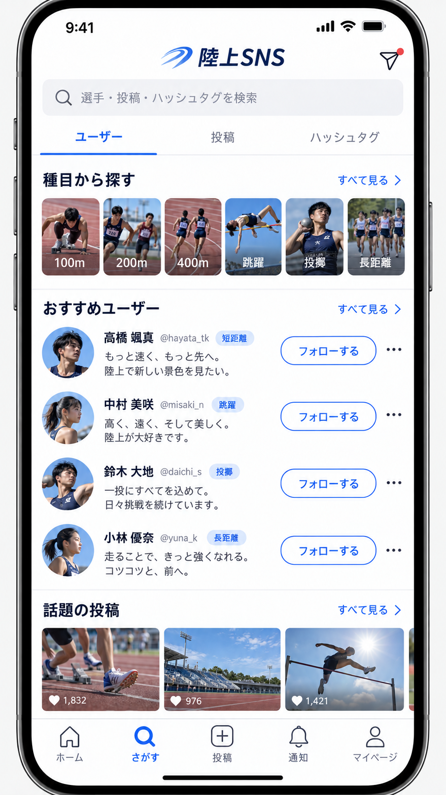

Elements:
- search field
- event chips
- recommended users
- trending / recommended posts
- hashtags

Search targets:
- users
- posts
- hashtags
- events

## DISC-002 Results

Tabs or filters:
- users
- posts
- tags

State:
- query empty
- loading
- no results
- error

---

# 6. Post Creation

## POST-001 Composer

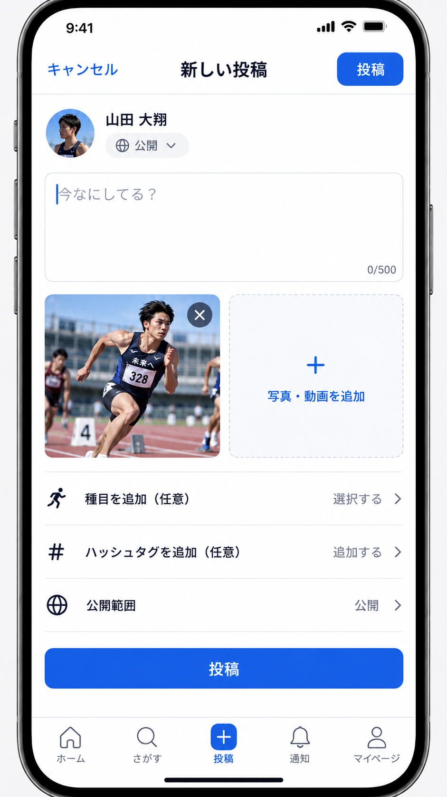

Elements:
- close
- publish
- text editor
- media preview
- add photo/video
- event tag optional
- hashtags optional
- visibility

Close with unsaved content:
- save draft
- discard
- cancel

Validation:
- text-only allowed
- media count limit
- video duration/size validation
- publish disabled during submit

## POST-005 Drafts

- local-first preferred for unfinished composer
- preview
- edited date
- delete

## POST-006 Uploading

- per-media progress
- overall state
- cancel where safe

## POST-007 Failure

- retry
- keep draft
- remove failed media

## POST-008 Edit

Editable:
- text
- hashtags
- event tag

Not editable v1:
- replace media

## POST-009 Detail

- full post
- comments
- replies
- actions

## POST-010 Comments Sheet

- bottom sheet from feed
- comments preview/list
- composer pinned near bottom
- open full detail when needed

---

# 7. Profile

## PROFILE-001 Own

Elements:
- avatar
- name
- username
- event chips
- optional prefecture / affiliation / age stage
- bio
- follower / following
- optional PB
- edit profile
- tabs: posts / media

## PROFILE-002 Other Public

- same core information
- Follow / Following
- Message if permitted
- overflow report/block/mute/share

## PROFILE-003 Private

Before follow approval:
- basic public profile only
- lock state
- no posts/media
- request follow CTA

## PROFILE-004 Edit

Required:
- display name
- username
- event interests

Optional:
- photo
- bio
- affiliation
- prefecture
- age/school stage display
- PB

Birth date is account/safety data, not casual public profile field.

---

# 8. Follow

Public:
- Follow -> immediate

Private:
- Follow -> Requested
- recipient sees SOCIAL-003
- accept / decline

UI must support:
- follow
- requested
- following
- mutually blocked/restricted state

Follower/following lists are searchable.

---

# 9. DM

## DM-001 List

- 1-to-1 only
- avatar / name
- last message preview
- timestamp
- unread badge
- request entry

Do not show group chats in v1 even if an old mock contains one.

## DM-002 Requests

- requester card
- text preview only
- accept
- decline/delete
- block/report

Request phase media cannot be sent.

13〜17歳は本人がフォローしていない相手からのrequestを受け付けない。未成年を含むDMが公開flagで停止中なら、送信ボタンの代わりに利用不可の説明を表示する。

## DM-003 Conversation

- text bubbles
- images/videos after allowed state
- read state
- typing indicator optional
- message composer
- report/block quick access

If teen safety rule blocks communication, composer is disabled with explanation.

会話を自分の一覧から削除する操作と、自分の送信メッセージを双方から取り消す操作は、影響範囲を分けて説明する。通報済みの内容は調査用記録に残る場合があることを案内する。

---

# 10. Notifications

NOTI-001 sections can include:
- social
- comments
- follow requests
- DM relevant notices
- system/moderation

Tap notification -> target screen.

Empty state should encourage activity without fake notifications.

---

# 11. Safety

## SAFE-004 Report

Flow:
1. choose reason
2. optional details
3. submit
4. confirmation

Never show reporter identity to reported user.

## SAFE-006 Restriction

Show:
- what feature is restricted
- broad reason
- duration if temporary
- appeal button when available

## SAFE-009 Suspended

- account unavailable
- appeal path
- support/legal links as appropriate
- no normal app navigation

---

# 12. Settings

SET-001:
- account
- privacy
- notifications
- DM settings
- blocked / muted
- support plan
- data saver
- help
- terms/privacy
- logout
- delete account

アカウント削除画面では、他ユーザーから直ちに非表示になる範囲、30日以内の取消方法、相手側DMの表示、調査用記録の例外を説明する。削除ジョブの完了状態を確認できるようにする。

SET-002 Privacy:
- private/public
- DM receive policy
- optional discoverability controls

Teen state:
- safer defaults
- explain consequences before loosening settings

---

# 13. Support Plan

BILL-001:
- clearly explain this is optional support
- current benefits
- current App Store price loaded from product metadata, not hard-coded UI mock
- restore purchases
- terms/subscription disclosure

Do not imply free users get worse reach.

---

# 14. Error / Empty States

Required examples:
- Home no posts
- Search no result
- Own profile no posts
- DM empty
- Notifications empty
- Saved empty
- Network error
- upload failed
- auth callback failed
- permission denied

Each state needs:
- human-readable message
- primary recovery action where possible

---

# 15. Permissions

Use pre-permission explanation screens only when useful, then native iOS permission dialog.

Push:
- ask after user understands value, not necessarily first launch

Photos:
- request at first media add

Camera:
- request only when camera action chosen

---

# 16. Accessibility

- VoiceOver labels for icon-only buttons
- Dynamic Type
- minimum tap target 44pt
- sufficient contrast
- do not communicate state only by color
- video captions infrastructure-ready
- reduce motion where appropriate

---

# 17. Analytics Screen Events

At minimum:
- `screen_view`
- `feed_opened`
- `post_impression`
- `post_opened`
- `composer_opened`
- `post_created`
- `profile_viewed`
- `follow_created`
- `follow_request_created`
- `dm_request_created`
- `dm_opened`
- `report_flow_opened`
- `report_created`
- `support_plan_viewed`

No sensitive message text in analytics payload.

---

# 18. UI Reference Assets

The `/assets` folder contains visual references. Use them for direction, not as pixel-perfect or text-authoritative specifications.

Key references:
- `home_feed.png`
- `search.png`
- `profile.png`
- `composer.png`
- `notifications.png`
- `dm_list.png`
- `dm_conversation.png`
- `post_detail.png`
- `onboarding_events.png`
- `profile_edit.png`
- `settings.png`
- `privacy.png`
- `message_requests.png`
- `report.png`
- `private_profile.png`
- `support_plan.png`
- `screen_map.png`
- `main_flows.png`

Known mock artifacts to ignore:
- `TrackConnect` is not final brand.
- support price shown in images is placeholder.
- old group chat depiction is not v1 scope.
- profile edit images that mark bio/event incorrectly required do not override this spec.
- onboarding image ordering does not override canonical onboarding flow.

---

# 19. UI Definition of Done

Every implemented screen must have:
- normal state
- loading state where applicable
- empty state where applicable
- error state
- permission/authorization handling
- accessibility labels
- analytics hook
- navigation test
- teen/private/restricted variants when relevant

UI implementation is not complete until server-side permissions agree with visible UI state.

## UI Reference Gallery

以下は既存のUI参考画像です。正式仕様は本文を優先してください。

### dm conversation

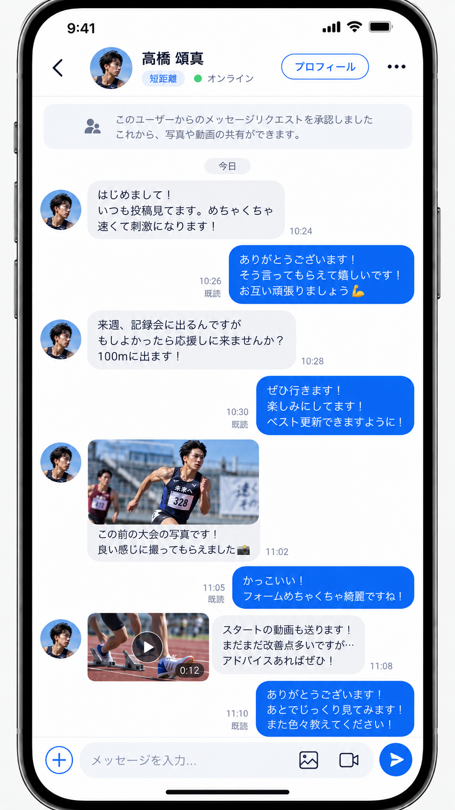

### dm list

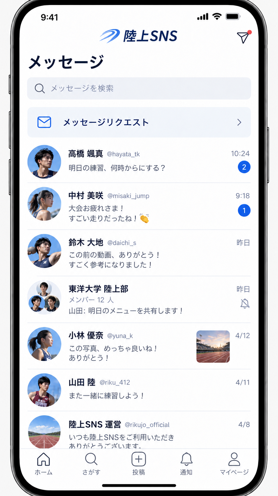

### main flows

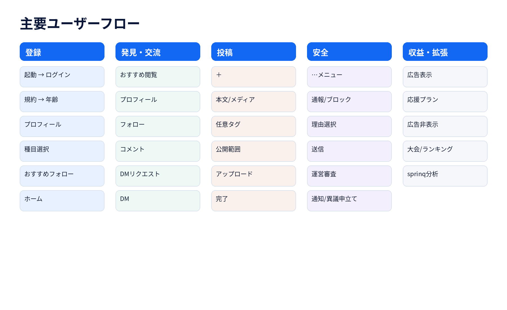

### message requests

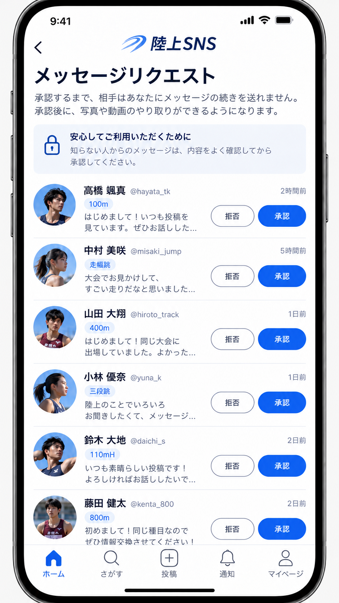

### notifications

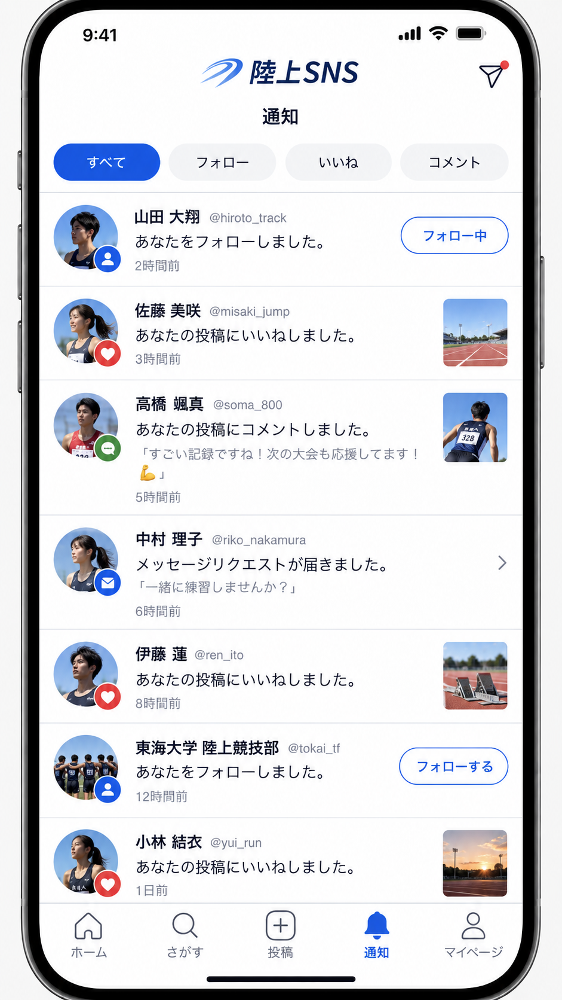

### old arch reference

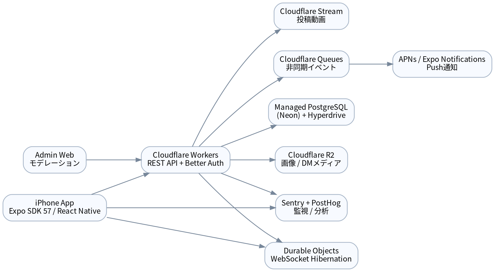

### onboarding events

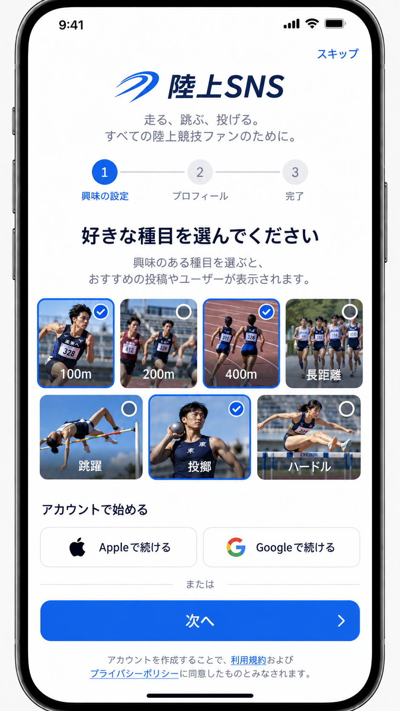

### post detail

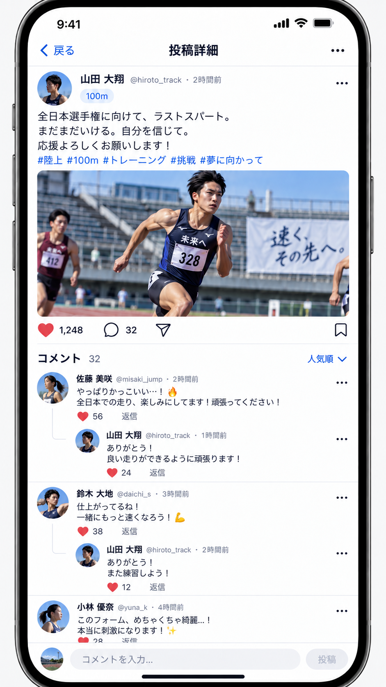

### privacy

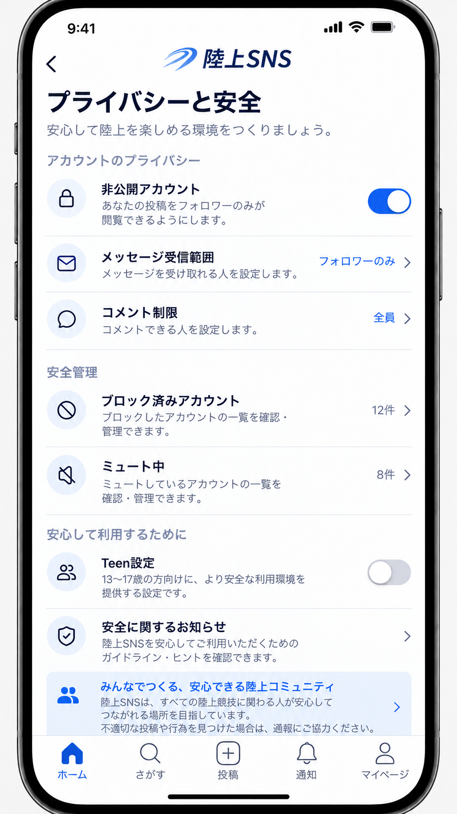

### private profile

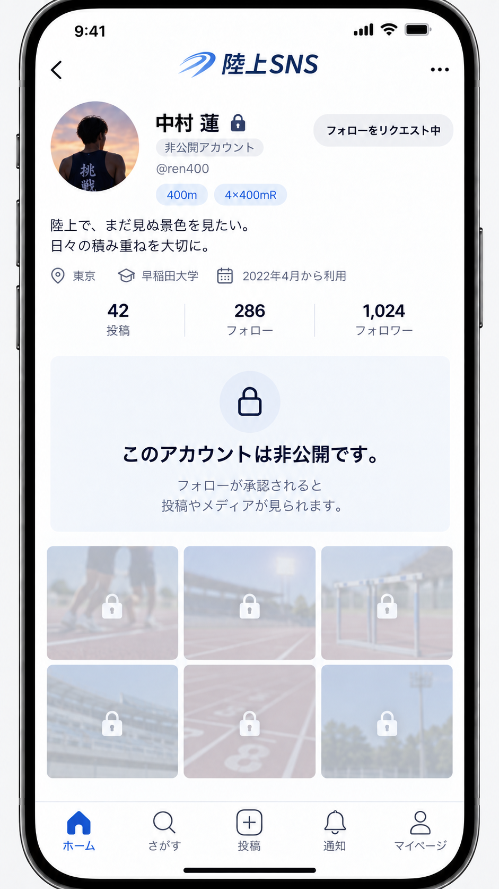

### profile edit

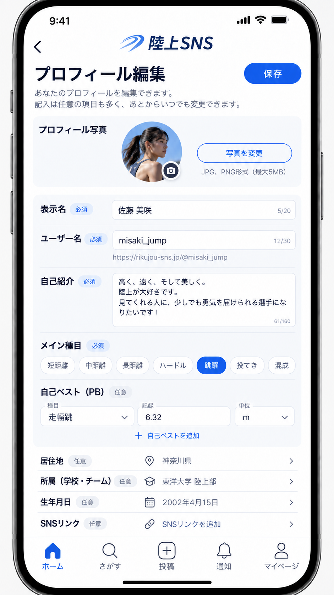

### report

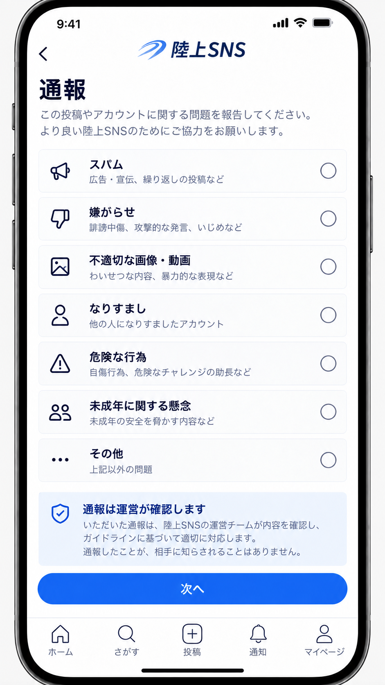

### screen map

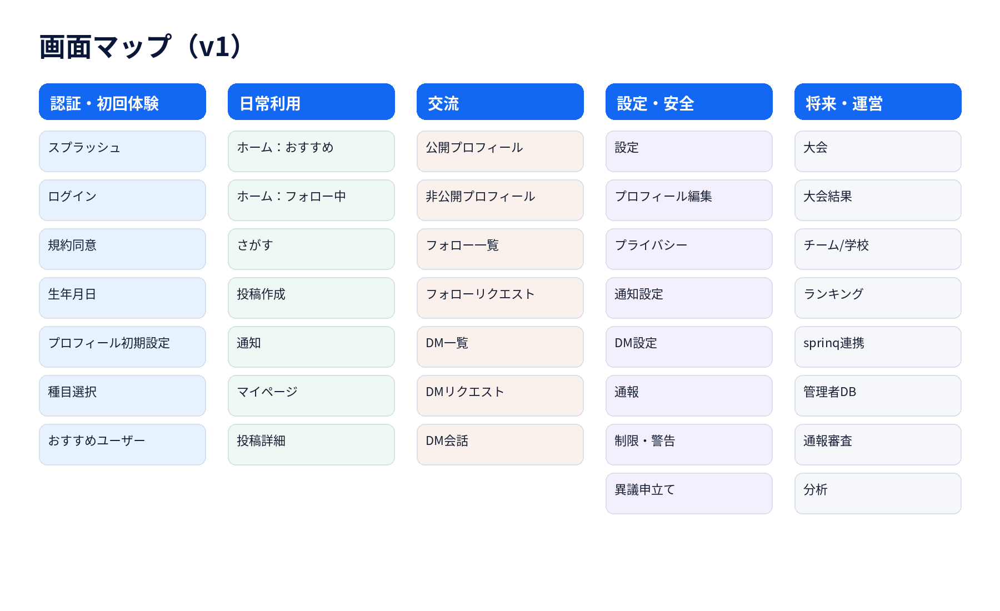

### settings

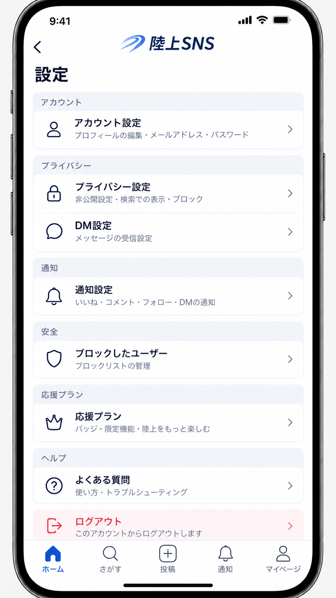

### support plan

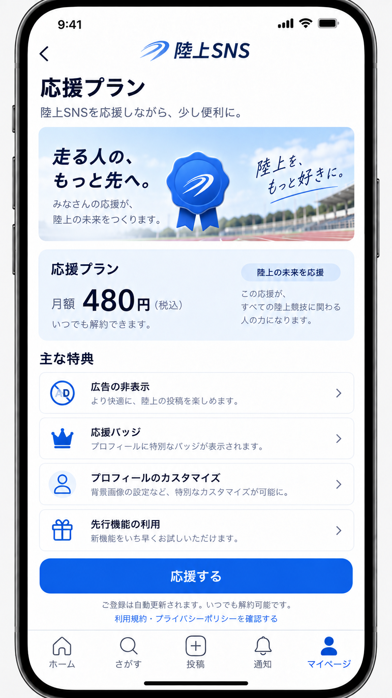
